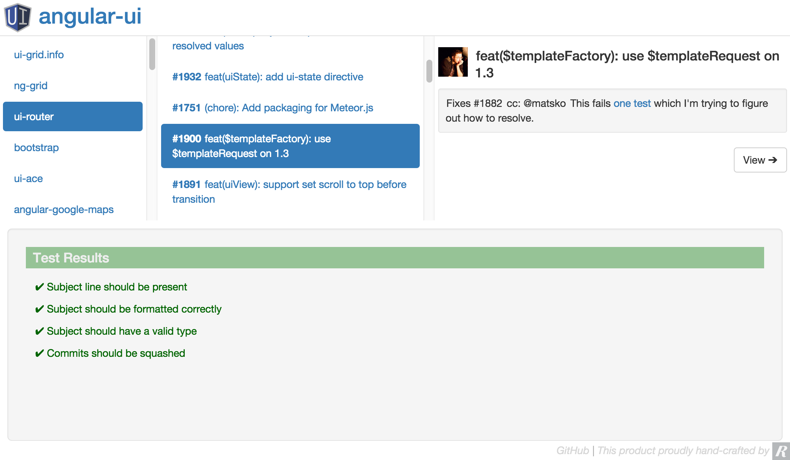

# PR.js

_Simple validation for pull request workflows_

---

### Why?

Most projects have rules of some kind about how to submit pull requests, which often include things like commit message formatting, squashing commits, etc. PR.js allows you to implement these rules as simple ES6 classes, using the GitHub API to check against open pull requests.

### Prior Art

 - [GitCop](https://gitcop.com/): Closed source, only validates commit messages based on a limited rule set
 - [Rolling your own](http://addamhardy.com/blog/2013/06/05/good-commit-messages-and-enforcing-them-with-git-hooks/): more flexibility; more work; access to local system; requires local installation; for commits, not PRs

### Get Going

 - `npm install -g gulp jspm`
 - `npm install`
 - [`jspm`](http://jspm.io/) `install`
 - `gulp serve`
 - [`http://localhost:3003`](http://localhost:3003)

**Test**

 - [`http://localhost:3003/test.html`](http://localhost:3003/test.html)

### Roadmap

 - Configurable rules
 - Load rules configuration from `package.json`
 - GitHub auth for private projects
 - Remote rule loading
 - Node server with [Build Status API](https://developer.github.com/v3/repos/statuses/) integration